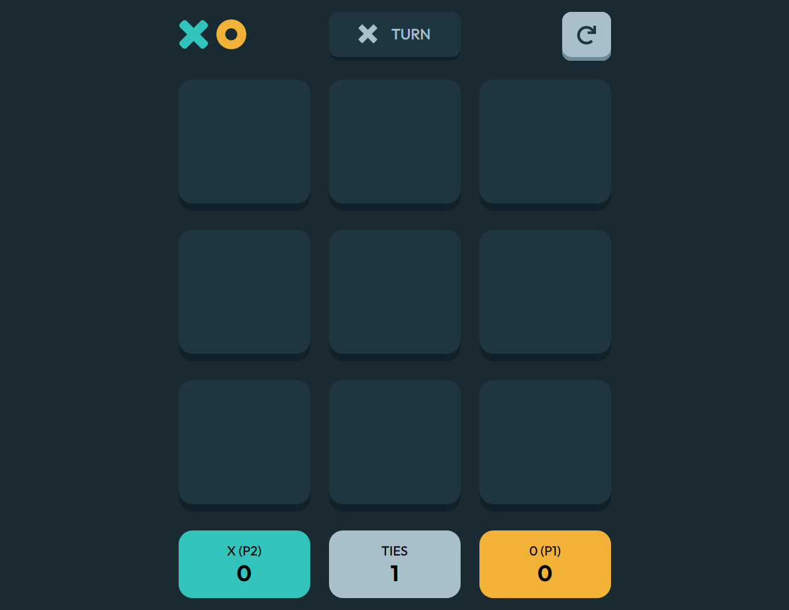

# Frontend Mentor - Tic Tac Toe solution

This is a solution to the [Tic Tac Toe challenge on Frontend Mentor](https://www.frontendmentor.io/challenges/tic-tac-toe-game-Re7ZF_E2v). Frontend Mentor challenges help you improve your coding skills by building realistic projects. 

## Table of contents

- [Overview](#overview)
  - [The challenge](#the-challenge)
  - [Screenshot](#screenshot)
  - [Links](#links)
- [My process](#my-process)
  - [Built with](#built-with)
  - [What I learned](#what-i-learned)
  - [Continued development](#continued-development)
- [Author](#author)

## Overview

### The challenge

Users should be able to:
- View the optimal layout for the game depending on their device's screen size
- Play the game either solo vs the computer or multiplayer against another person
- Game results are saved in sessionStorage so that it’s preserved if the player refreshes their browser
- In solo mode when playing against computer, computer behaves in both random and predefined ways: it selects random cells until the moment it detects the need to prevent from user actions to win the game.

### Screenshot

.png)
.png)
%20(1).png)
.png)
.png)

### Links

- Solution URL: [Add solution URL here](https://your-solution-url.com)
- Live Site URL: [Add live site URL here](https://your-live-site-url.com)

## My process

### Built with

- Semantic HTML5 markup
- CSS custom properties
- Flexbox
- CSS Grid
- DOM
- Express.js

### What I learned

Loads of work with DOM. 
Creating modals was a new experience. 
The biggest challenge wsa to create the logic for CPU independent moves, both random as well as predefined.
In order to make UX smoother I used setTimeout functions to slightly slower CPU moves, but that caused side issues which took some time to work around.
Saving results to sessionStorage was also new thing to learn. 

### Continued development

Need to work on error handling. 
Also will work on projects that include JSON files, APIs, DBs.

## Author

- Website - [Tomas Vask](https://github.com/TomasVask)
- Frontend Mentor - [@TomasVask](https://www.frontendmentor.io/profile/TomasVask)